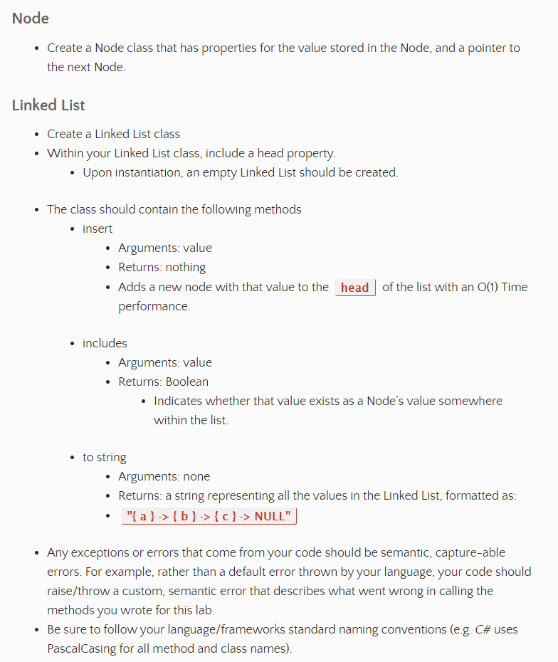
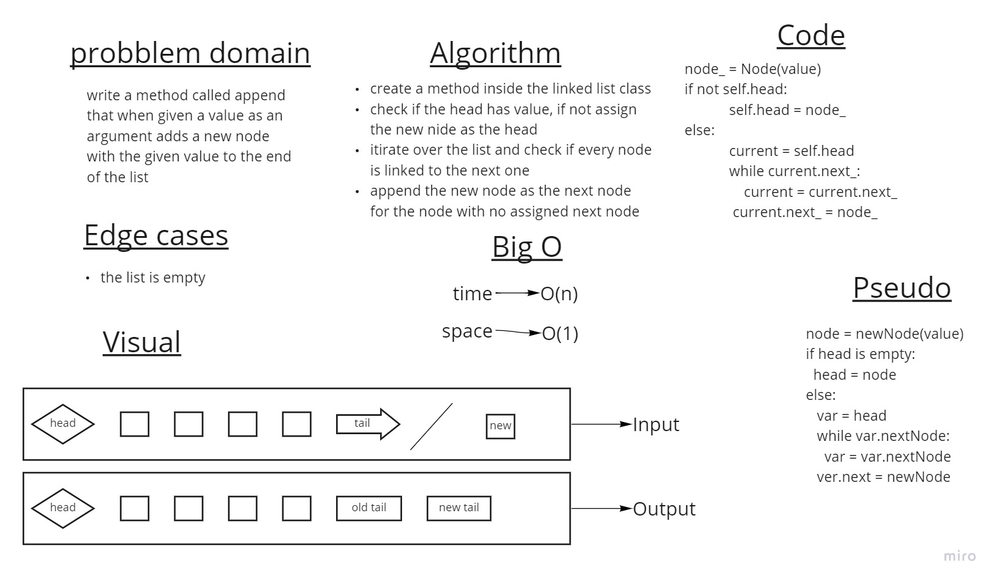
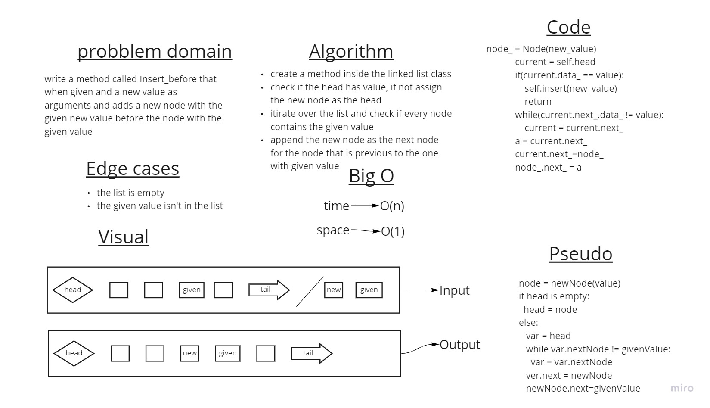
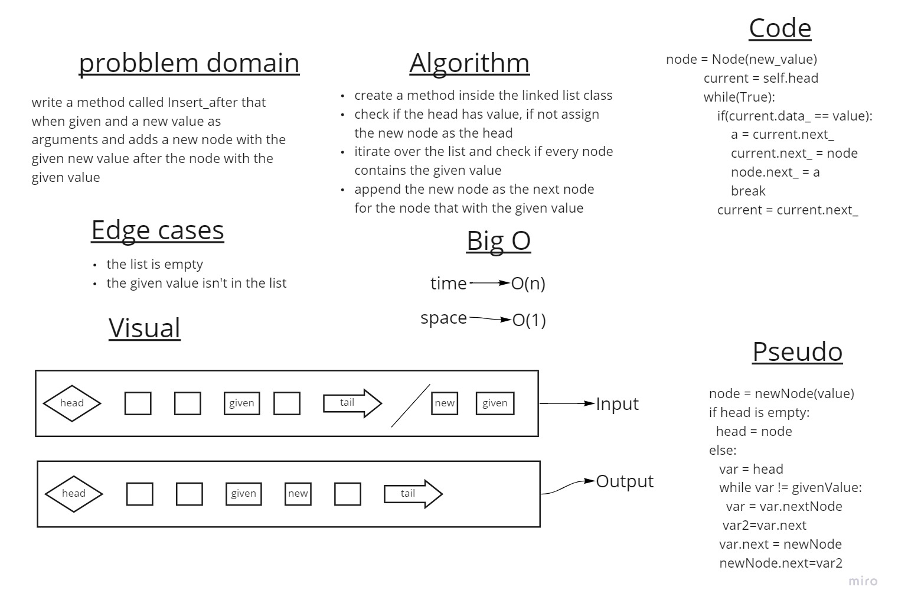
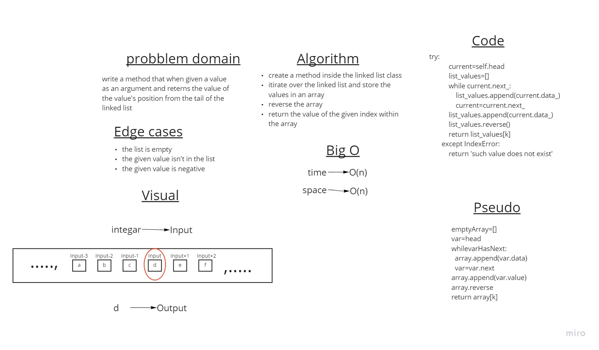
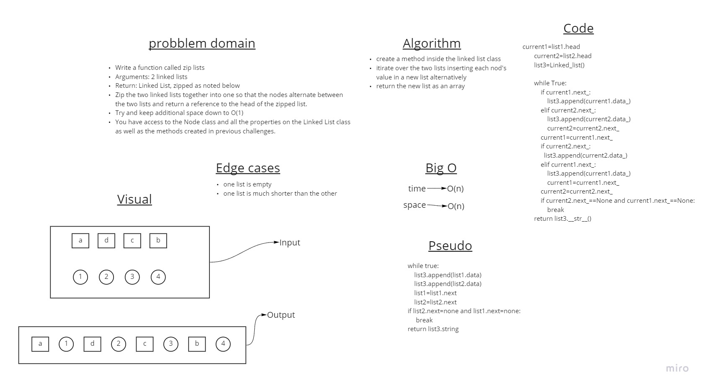

# Singly Linked List

A linked list is a sequence of data elements, which are connected together via links. Each data element contains a connection to another data element in form of a pointer. Python does not have linked lists in its standard library. We implement the concept of linked lists using the concept of nodes.

## Challenge

## Approach & Efficiency

Big O for space = O(1)
Big O for time = O(n)

using classes to implement linked list data structure.

## API

- [x] Can successfully instantiate an empty linked list
- [x] Can properly insert into the linked list
- [x] The head property will properly point to the first node in the linked list
- [x] Can properly insert multiple nodes into the linked list
- [x] Will return true when finding a value within the linked list that exists
- [x] Will return false when searching for a value in the linked list that does not exist
- [x] Can properly return a collection of all the values that exist in the linked list
- [x] Can successfully add a node to the end of the linked list
- [x] Can successfully add multiple nodes to the end of a linked list
- [x] Can successfully insert a node before a node located i the middle of a linked list
- [x] Can successfully insert a node before the first node of a linked list
- [x] Can successfully insert after a node in the middle of the linked list
- [x] Can successfully insert a node after the last node of the linked list
- [x] Where k is greater than the length of the linked list
- [x] Where k and the length of the list are the same
- [x] Where k is not a positive integer
- [x] Where the linked list is of a size 1
- [x] “Happy Path” where k is not at the end, but somewhere in the middle of the linked list

## PR:

https://github.com/anas-abusaif/data-structures-and-algorithms-python/pull/10

## White board process

### Append:

### Insert before:

### Insert after:

### Return Kth value:

### ziplists:

