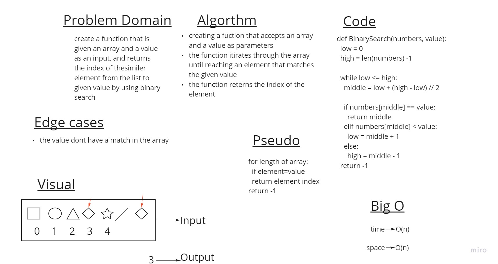

# Binary Search of Sorted Array

create a function that is given an array and a value as an input, and returns the index of thesimiler element from the list to given value

## Whiteboard Process

## Approach & Efficiency

Big O of time = O(1)
Big O of space = O(n)

the function is comparing each element of the array with the given value and reterns the index of the element if they are matched