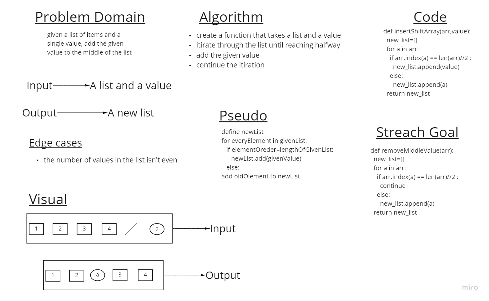

# Insert to Middle of an Array

given a list and a value, the app adds the value to the middle of the list.

## Whiteboard Process

## Approach & Efficiency

Big O of time= O(1)
Big O of space = O(n)
the function is assigning the same values of the old list into a new list respectivly but halfway it adds the given value.
