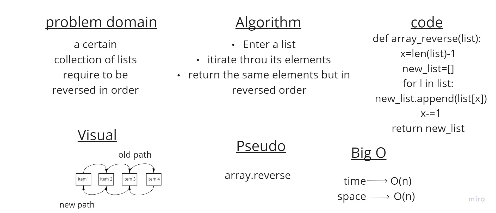

# Reverse an Array

as given a list, the app reverses this list's items.

## Whiteboard Process

## Approach & Efficiency

Time Big O = O(n)
Space Big O = O(n)
Negative values can be used in list slicing (and normal list indexing). When negative values are used for the first and second values in a slice (or a normal index), they count from the end of the list.