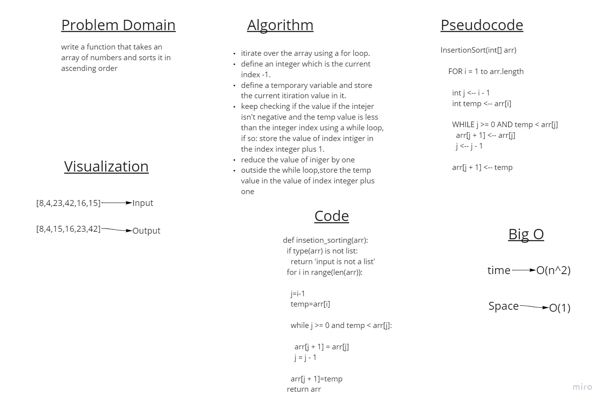

# Challenge Summary

Review the pseudocode below, then trace the algorithm by stepping through the process with the provided sample array. Document your explanation by creating a blog article that shows the step-by-step output after each iteration through some sort of visual.

Once you are done with your article, code a working, tested implementation of Insertion Sort based on the pseudocode provided.

## Whiteboard Process

## Approach & Efficiency

Big O of time = O(n^2)
Big O of space = O(1)

## Solution

further explanation is in the [BLOG](BLOG.md)