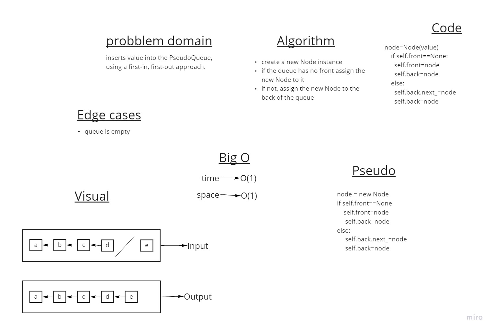
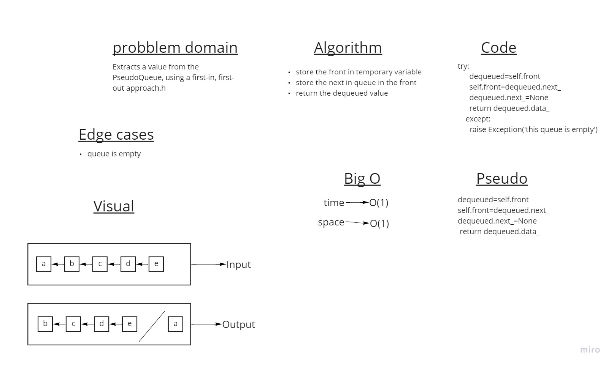

# Stacks and Queues
two types of data structure that forms data in queues or stacks
## Challenge
Create a Stack class that has a top property. It creates an empty Stack when instantiated.

This object should be aware of a default empty value assigned to top when the stack is created.

Create a Queue class that has a front property. It creates an empty Queue when instantiated.

This object should be aware of a default empty value assigned to front when the queue is created.
## Approach & Efficiency
Big O for space = O(1) Big O for time = O(n)

using classes to implement Stack and queue data structures.
## API

[x] - Can successfully push onto a stack
[x] - Can successfully push multiple values onto a stack
[x] - Can successfully pop off the stack
[x] - Can successfully empty a stack after multiple pops
[x] - Can successfully peek the next item on the stack
[x] - Can successfully instantiate an empty stack
[x] - Calling pop or peek on empty stack raises exception
[x] - Can successfully enqueue into a queue
[x] - Can successfully enqueue multiple values into a queue
[x] - Can successfully dequeue out of a queue the expected value
[x] - Can successfully peek into a queue, seeing the expected value
[x] - Can successfully empty a queue after multiple dequeues
[x] - Can successfully instantiate an empty queue
[x] - Calling dequeue or peek on empty queue raises exception

## PR
https://github.com/anas-abusaif/data-structures-and-algorithms-python/compare/stack-and-queueu?expand=1

## Whiteboard Process

### Enqueue

### Dequeue

